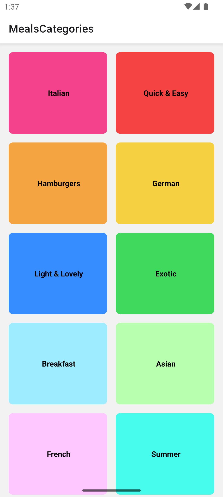
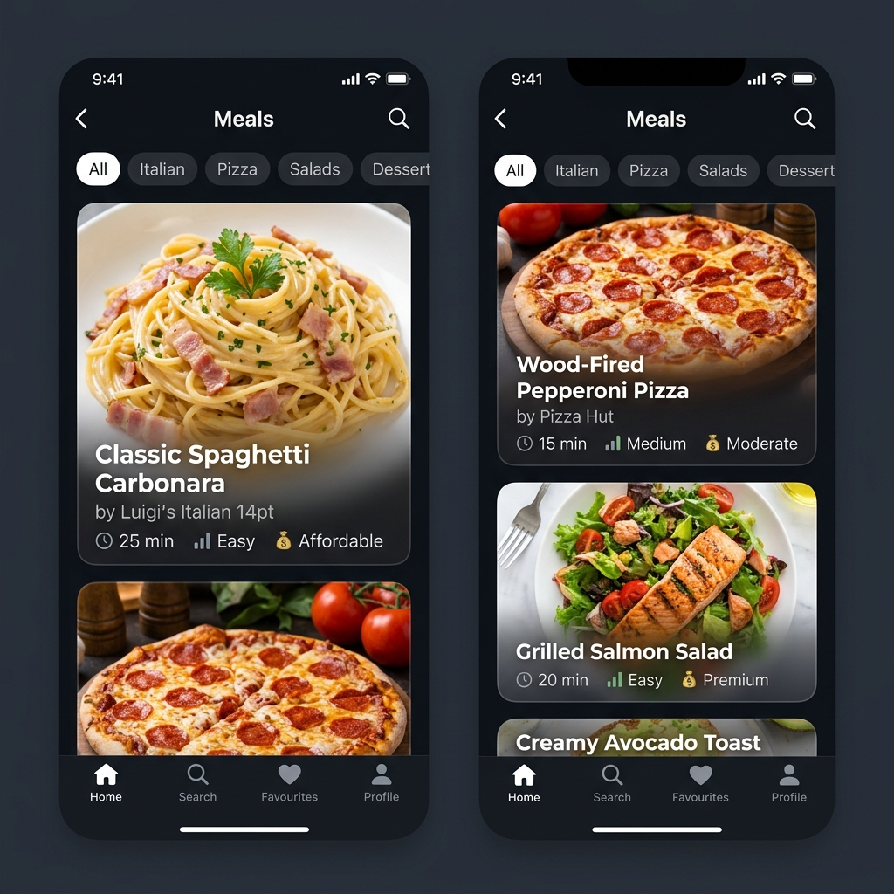

# FoodApp - Meals & Recipes Browser

A vibrant and responsive React Native application built with Expo that allows users to explore various food categories and discover delicious meals.

## 🚀 Features

- **Category Browsing**: Explore a wide range of food categories like Italian, Mexican, Hamburgers, and more.
- **Meal Overview**: Dedicated screens for viewing meals within a specific category with details and images.
- **Native Navigation**: Seamless transitions using `@react-navigation/native-stack`.
- **Responsive UI**: Optimized layouts using custom components and React Native's styling system.

## 🛠 Tech Stack

- **Framework**: [React Native](https://reactnative.dev/) via [Expo](https://expo.dev/)
- **Navigation**: [React Navigation 7](https://reactnavigation.org/)
- **Styling**: Vanilla React Native StyleSheet
- **Icons**: Expo Vector Icons

## 📂 Project Structure

```text
FoodApp/
├── assets/           # Application icons, splash screens, and images
├── components/       # Reusable UI components (FoodItem, PressableView, etc.)
├── data/             # Mock data (dummy-data.js)
├── models/           # Data models (category.js, meal.js)
├── screens/          # Main application screens (Categories, MealsOverview)
├── App.js            # Root component & Navigation setup
└── package.json      # Dependencies and scripts
```

## 🏁 Getting Started

### Prerequisites

- [Node.js](https://nodejs.org/) (LTS)
- [Expo Go](https://expo.dev/expo-go) app on your mobile device or an Emulator/Simulator.

### Installation

1. **Clone the repository:**
   ```bash
   git clone https://github.com/mayankneeds/FoodItems-ReactNative.git
   cd FoodItems-ReactNative
   ```

2. **Install dependencies:**
   ```bash
   npm install
   ```

### Running the App

Start the development server:

```bash
npm start
```

- **Open on iOS**: Press `i`
- **Open on Android**: Press `a`
- **Open on Web**: Press `w`

## 📱 Screenshots

<div align="center">
  
  
</div>

---

Developed with ❤️ by [Mayank Sharma](https://github.com/mayankneeds)
